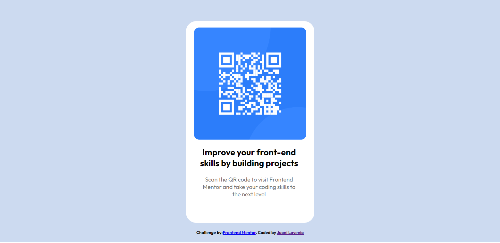

# Frontend Mentor - QR code component solution

This is a solution to the [QR code component challenge on Frontend Mentor](https://www.frontendmentor.io/challenges/qr-code-component-iux_sIO_H). Frontend Mentor challenges help you improve your coding skills by building realistic projects.

## Table of contents

- [Overview](#overview)
  - [Screenshot](#screenshot)
  - [Links](#links)
- [My process](#my-process)
  - [Built with](#built-with)
- [Author](#author)

## Overview

### Screenshot

### Links

- Live Site URL: [Vercel](https://qr-code-frontend-mentor-tau-three.vercel.app)

## My process

### Built with

- React-Vite
- CSS custom properties
- Flexbox
- Bootstrap
- Mobile-first workflow
- [React](https://reactjs.org/) - JS library
- [Vite](https://vitejs.dev) - React tool
- [Bootstrap](https://getbootstrap.com) - For styles

## Author

- Frontend Mentor - [@JuaniLavenia](https://www.frontendmentor.io/profile/JuaniLavenia)
- Twitter - [@juanilavenia](https://twitter.com/juanilavenia)
